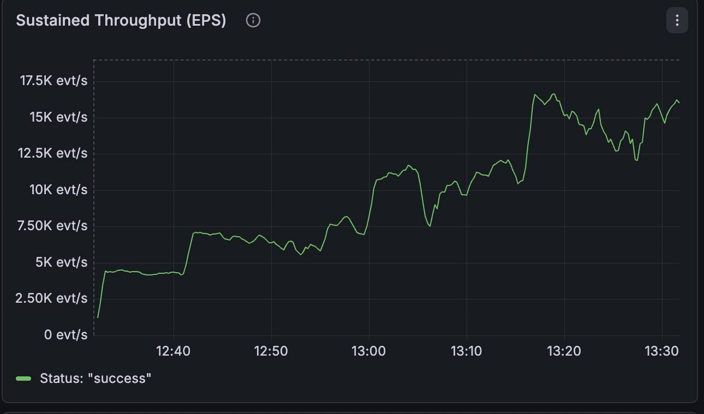
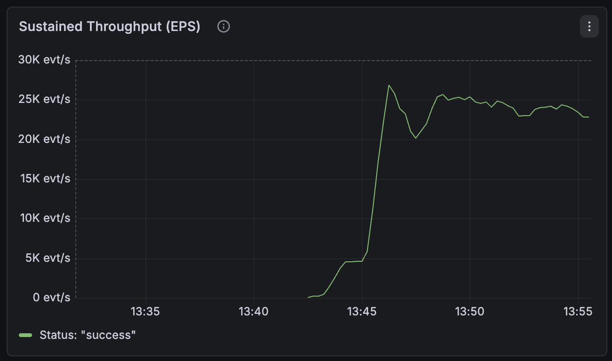

import { Aside, Card, CardGrid, Steps, Tabs, TabItem } from '@astrojs/starlight/components';

This document details the performance evaluation of the Open Outbox Relay, comparing an unoptimized baseline against a tuned production configuration.

---

## 1. Environment & Test Specifications

To ensure reproducibility, the benchmark was conducted on a dedicated local environment with the following hardware and workload parameters.

| Category | Parameter | Specification |
| :--- | :--- | :--- |
| **Hardware** | Model | MacBook Pro M1 (32GB RAM) |
| | Storage | Integrated Apple Silicon NVMe SSD |
| **Workload** | Event Payload | 200 Bytes |
| | Backlog Volume | 100M+ Events |
| | Engine | PostgreSQL 16.4 |

## 2. Optimization Parameters

To establish a clear performance delta, we conducted the initial **Draining** phase on a default, unoptimized PostgreSQL setup. For the final **Bench** phase, we applied high-throughput tuning to measure the peak performance potential of the relay.

### PostgreSQL Configuration Tuning

The following parameters were applied to `postgresql.conf` to achieve the **20K+ EPS** milestone:

| Parameter | Value | Rationale |
| :--- | :--- | :--- |
| `shared_buffers` | **4GB** | Allocated 12.5% of total RAM for data caching. |
| `work_mem` | **64MB** | Increased memory for internal sort operations. |
| `maintenance_work_mem` | **512MB** | Accelerated index maintenance and vacuuming. |
| `synchronous_commit` | **off** | Decoupled transaction success from disk flush (**Async Logging**). |
| `checkpoint_timeout` | **15min** | Reduced the frequency of heavy disk flushes. |
| `max_wal_size` | **4GB** | Expanded the WAL ceiling to prevent frequent checkpoints. |
| `random_page_cost` | **1.1** | Optimized for NVMe seek speeds. |

<Aside type="tip">
**Note on Methodology:** The Draining Mode was intentionally run without these optimizations to capture a "worst-case" baseline. The Benchmark Mode utilizes these optimizations to measure the system's maximum sustainable throughput.
</Aside>

## 3. Unoptimized Draining

To establish a "worst-case" performance floor, the relay was tasked with clearing a **100M+ event backlog** using out-of-the-box PostgreSQL settings.

<Steps>
1. **Backlog Setup:** The outbox table was pre-populated, creating a high-pressure scenario for the index and storage engine.
2. **Worker Initialization:** 12 workers were deployed to begin the concurrent polling and Kafka delivery.
3. **I/O Saturation:** The system quickly hit a throughput ceiling. Adding more workers resulted in increased disk wait rather than increased EPS.
</Steps>

### Performance Breakdown

<Tabs>
  <TabItem label="Key Metrics" icon="list-format">
    | Metric | Result |
    | :--- | :--- |
    | **Stable Throughput** | 14,500 EPS |
    | **Primary Bottleneck** | Disk I/O Wait (`fsync`) |
    | **CPU Utilization** | ~20% (Significant Headroom) |
    | **Disk Latency** | High (Synchronous WAL writes) |
  </TabItem>
  <TabItem label="Technical Observations" icon="magnifier">
    | Observation | Technical Validation |
    | :--- | :--- |
    | **I/O Persistence Barrier** | While `SKIP LOCKED` prevented row-level contention, the default `synchronous_commit = on` forced workers into an I/O wait state during transaction finalization. |
    | **Diminishing Returns** | Increasing concurrency beyond 12 workers provided zero net gain; the throughput was capped by the SSD's maximum `fsync` frequency. |
  </TabItem>
</Tabs>

*Figure 1: Grafana metrics showing the 14,500 EPS plateau during the unoptimized draining phase.*

---

## 4. Optimized Benchmarking

With the tuning parameters from Section 2 applied, we moved the performance ceiling from the I/O layer to
the Index Arbitration layer.

| Metric | Value | Description |
| :--- | :--- | :--- |
| **Peak Throughput** | **20,100+ EPS** | A sustained milestone achieved with 12 workers. |
| **Performance Gain** | **+42.5% Improvement** | Measured against the 14.5K unoptimized baseline. |

### Throughput Scaling by Worker Count

Efficiency remained high until the system reached the single-table throughput limit of the PostgreSQL index.

| Worker Count | Throughput (EPS) | Scaling Efficiency |
| :--- | :--- | :--- |
| 1 Worker | 5K | 100% (Baseline) |
| 4 Workers | 14K | 89% |
| 8 Workers | 19K | 84% |
| **12 Workers** | **22.1K** | **67% (Saturation)** |

<Tabs>
 <TabItem label="Bottleneck Shift" icon="random">
    In this phase, **I/O Wait dropped to near 0%**. However, throughput plateaued at **22.1K EPS** despite the CPU sitting idle at 20%.

    This proves the hardware wasn't the problem. The bottleneck shifted entirely to **Index Locking**. Even with `SKIP LOCKED`, there is a limit to how fast 12 workers can coordinate on a single index. To go faster, you would need **Table Partitioning** to give the workers more than one index to talk to at the same time.
  </TabItem>
  <TabItem label="Kafka Egress" icon="external-link">
    The Kafka broker maintained a stable consumer lag of near-zero. The 20K EPS produced by the relay was successfully ingested and acknowledged, confirming that the network stack and downstream broker were not the limiting factors in this benchmark.
  </TabItem>
</Tabs>

*Figure 2: Sustained 20K EPS throughput showing consistent performance with optimized PostgreSQL settings.*

---

## 5. Final Verdict

### The Performance Delta

| Metric | Unoptimized (Draining) | Optimized (Bench) | Delta |
| :--- | :--- | :--- | :--- |
| **Throughput (EPS)** | 14,100 | **22,100** | **+42.5%** |

### Summary of Findings

<Steps>
1. **Draining Phase:** Validated that the system can handle massive backlogs reliably at a rate of 1.2 Billion events per day, even without tuning.
2. **Bench Phase:** Demonstrated that with specific tuning, the Relay exceeds **1.7 Billion events per day** on a single M1 machine.
3. **Production Readiness:** The Relay demonstrated high efficiency in managing internal memory and worker state, proving that the software logic is not the bottleneck.
</Steps>
